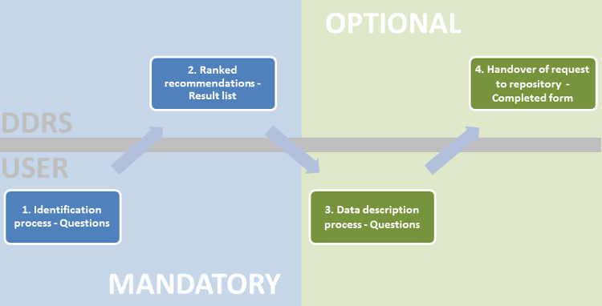

[Back to DDRS index](index.md)

## Concept of the service
The service connects researchers who search for a deposit service on the one hand and the repositories and data centres on the other hand which have a mandate to acquire content and it aims at establishing incentives for both sides to deposit and ingest research data in the humanities.

The service is technically a registry of deposit services for research data from the Humanities. It catalogues repositories and research data centres and delivers standardised metadata on them, allowing the researcher to decide which repository may be the most qualified one for his case. The collection of the data will initially be done manually but anticipate future automated procedures to harvest data from repositories. The registry takes into account the heterogeneity of data and the often compartmentalised research structures in the humanities. Obviously it also takes into account already established services such as re3data.org but functions – as a main distinction – on a discipline-specific level.

#### For whom is the DDRS useful?
The DDRS is geared towards researchers and research projects from the arts and humanities, especially from the digital humanities.

#### What is the main function of the DDRS?
It addresses the question of how and where to deposit research data, an issue gaining increasingly importance as reuse of research data becomes more common and more funders require the deployment of data taking into account the aspect of reproducibility of research. Through a guided concise inquiry of the user the system recommends the best suited data deposit locations for the individual case. The user can compare the results of his request and gets then pointed to these deposit locations.

#### Additional functions
Beyond this main objective the DDRS also aims at raising awareness for research data repositories and improve collaboration and interoperability between such services. An area with large potential in this regard will be the use of re3data.org database for identifying suitable repositories for the researcher.

#### User workflow

##### Identification of suitable repositories
After answering a very few mandatory questions the user receives a ranked list of repository recommendations. The ranking is based on an internal but simple mechanism. For instance a repository that is able to offer certain services or functionalities gets ranked higher than a repository only able to store file-based research data. These aspects do not have to be answered by the user because the ranking can be undertaken quite simply on the service side and because most users probably care about areas as licensing, metadata schemas or long-term preservation but may not be able to verbalise them in information science terminology.

A good visualisation of such a faceted browsing could look like [re3data.org](http://www.re3data.org/) has implemented the browsing by subject. The underlying technical solution uses a database with repositories tagged with classifications of the covered content. The user browses through this metadata and gets very quickly results, leading him to the desired repositories.

##### Individual case description to initiate the communication process between researcher and repository
In the second tier the user may - if he wishes so - describe his or her specific case, i.e. the research data that shall be deposited. The research data concerned is described by the user along a few standardised categories, like format, data volume, licences and so on. Aim of this description is to allow the repository an overview of the specific ingest case and to prepare for the communication with the researcher. This information, along with personal contact information, flows into a form that can be forwarded to the prefered repository at the instigation of the user. The second tier is optional, in other words, the user should have useful information about a suitable repository for their Data Management Plan, after the first tier.